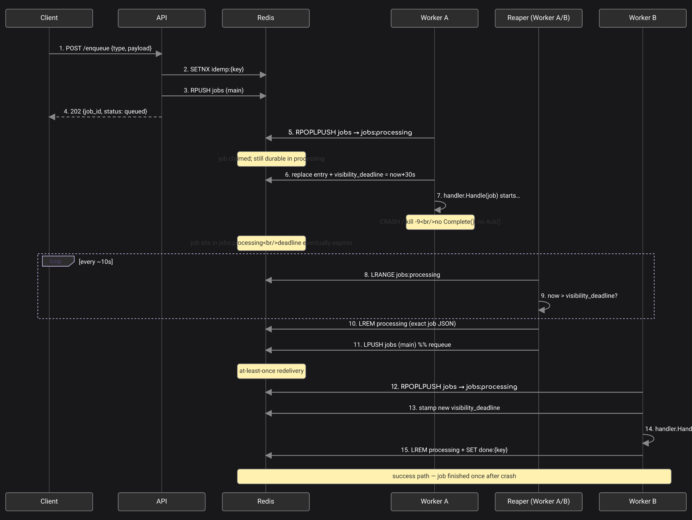
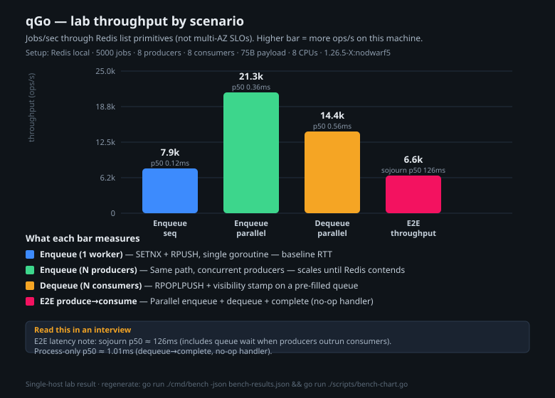

# qGo

Lightweight async job queue in **Go** with a **Redis** backend. Built for learning / resume / interview prep — demonstrates durability, visibility timeouts, idempotency, retries/DLQ, and Prometheus metrics.

## Architecture

```
┌─────────────┐     ┌─────────────┐     ┌─────────────┐
│  API        │     │  Redis      │     │  Workers    │
│  (enqueue)  │────▶│  Lists      │────▶│  (process)  │
└─────────────┘     │  + keys     │     └─────────────┘
                    │             │            ▲
                    └─────────────┘            │
                          │                    │
                          ▼                    │
                    ┌─────────────┐     ┌─────────────┐
                    │  DLQ        │     │  Reaper     │
                    │  (failed)   │◀────│  (stale)    │
                    └─────────────┘     └─────────────┘
```

### Flow: enqueue → claim → crash → reaper redelivery

Sequence for the happy path plus worker crash recovery (visibility timeout → at-least-once redelivery → another worker completes).



1. **Enqueue** — `SETNX idemp:{key}` then `RPUSH` main list; `202` with `job_id`
2. **Claim** — worker `RPOPLPUSH` main → processing, stamps `visibility_deadline`
3. **Crash** — no `Complete`/`Ack`; job stays in processing until deadline
4. **Reap** — periodic scan requeues expired processing entries to main
5. **Redeliver** — another worker claims and finishes; `done:{key}` marks completion

## Quick start

```bash
# Redis (podman or docker)
podman run -d --name qgo-redis -p 6379:6379 redis:7-alpine
# or: docker run -d --name qgo-redis -p 6379:6379 redis:7-alpine

# Terminal 1 — API
REDIS_ADDR=localhost:6379 go run ./cmd/jobqueue -mode api

# Terminal 2 — Worker (demo handlers: email.send, echo)
REDIS_ADDR=localhost:6379 go run ./cmd/jobqueue -mode worker

# Docker Compose (if available)
docker compose up --build
```

## API

### Enqueue
```bash
curl -X POST http://localhost:8080/enqueue \
  -H "Content-Type: application/json" \
  -d '{"type":"email.send","payload":{"to":"user@example.com","subject":"hi"},"priority":5,"idempotency_key":"optional-client-key"}'
# 202 {"job_id":"...","status":"queued"}
# 409 if idempotency_key already used
```

### Health
```bash
curl http://localhost:8080/health
# {"status":"healthy","queue_depth":0,"processing_depth":0,"oldest_job_age_seconds":0,"dlq_depth":0}
```

### Metrics
- API: `GET http://localhost:8080/metrics` (enqueue counters)
- Worker: `GET http://localhost:9091/metrics` (process / retry / lag gauges) — set `METRICS_PORT`

## Demo handlers

Registered in the worker binary:

| Type | Behavior |
|------|----------|
| `email.send` | Requires `payload.to`; logs a simulated send |
| `echo` | Logs payload; always succeeds |

```bash
curl -X POST http://localhost:8080/enqueue \
  -H "Content-Type: application/json" \
  -d '{"type":"echo","payload":{"msg":"hello"}}'
```

## Metrics

| Metric | Type | Where | Description |
|--------|------|-------|-------------|
| `jobs_enqueued_total` | Counter | API | Jobs accepted |
| `jobs_processed_total` | Counter | Worker | Jobs completed |
| `jobs_failed_total` | Counter | Worker | Jobs moved to DLQ |
| `jobs_retried_total` | Counter | Worker | Retry attempts |
| `jobs_reaped_total` | Counter | Worker | Stale jobs requeued |
| `queue_depth` | Gauge | Worker | Main queue length |
| `processing_depth` | Gauge | Worker | In-flight jobs |
| `dlq_depth` | Gauge | Worker | Dead-letter count |
| `job_duration_seconds` | Histogram | Worker | Processing latency |
| `queue_lag_seconds` | Gauge | Worker | Oldest job age |

## Benchmarks / performance report

Requires a running Redis (`REDIS_ADDR`, default `localhost:6379`).

### Go microbenchmarks (ns/op, allocs)

```bash
go test ./internal/queue/ -bench=. -benchmem -count=1
```

| Benchmark | Notes |
|-----------|--------|
| `BenchmarkEnqueue` | `SETNX` + `RPUSH` path |
| `BenchmarkDequeue` | `RPOPLPUSH` + visibility stamp |
| `BenchmarkRoundTrip` | enqueue → dequeue → complete |
| `BenchmarkEnqueueParallel` | concurrent producers |
| `BenchmarkJobMarshal` / `Unmarshal` | pure JSON CPU cost |

### Load report (throughput + latency percentiles)

```bash
go run ./cmd/bench -jobs 5000 -producers 8 -consumers 8 -json bench-results.json
go run ./scripts/bench-chart.go   # → assets/bench-throughput.svg
```



| scenario | ops/s | p50 ms | p95 ms | p99 ms |
|----------|------:|-------:|-------:|-------:|
| enqueue_sequential | 7.9k | 0.12 | 0.15 | 0.22 |
| enqueue_parallel | 21.3k | 0.36 | 0.44 | 0.56 |
| dequeue_parallel | 14.4k | 0.56 | 0.66 | 0.73 |
| e2e sojourn (create→done) | 6.6k | 126 | 693 | 745 |
| e2e process only (dequeue→done) | — | 1.01 | 1.85 | 2.02 |

Single-host lab (Redis 7, 8 CPUs, 5k jobs). E2E sojourn includes queue wait under producer burst; process = dequeue→complete (no-op handler). Not multi-AZ SLOs.

## Design decisions & trade-offs

1. **Redis lists + atomic move vs Postgres `SKIP LOCKED`** — Chose Redis for sub-ms latency and simple ops. Trade-off: no ACID durability without replicas; at-least-once requires idempotent handlers.
2. **At-least-once + idempotency vs exactly-once** — Enqueue-time `SETNX` on `idemp:{key}` (409 on conflict); completion writes `done:{key}` so reaper requeues do not re-run finished work. Simpler than distributed consensus.
3. **No delayed / priority lanes in v1** — Scope cut for a few-hour build. `priority` exists on the job for a future weighted-fair lane; `run_at` would need a sorted-set scheduler.

## Interview soundbites

1. **Atomic dequeue**: `RPOPLPUSH` main → processing, then stamp a visibility deadline on the payload so a reaper can reclaim hung workers.
2. **Idempotency**: Client key at enqueue (`SETNX`); completion marker so retries/reaps stay safe.
3. **Observability**: Queue depth + oldest-job lag answer “are workers keeping up?” — not just processed/failed counters.

## Config (env)

| Variable | Default |
|----------|---------|
| `REDIS_ADDR` | `localhost:6379` |
| `REDIS_PASSWORD` | empty |
| `QUEUE_NAME` | `jobs` |
| `VISIBILITY_TIMEOUT` | `30` (seconds) |
| `WORKER_CONCURRENCY` | `NumCPU` |
| `PORT` | `8080` (API) |
| `METRICS_PORT` | `9091` (worker) |
| `LOG_LEVEL` | `INFO` |

## Resume line

> **qGo** — Go, Redis  
> Built a production-style async job queue with durable dequeue (processing list + visibility timeout reaper), exponential backoff retries, dead-letter handling, and idempotency keys. Exposed Prometheus metrics (queue depth, lag, throughput) and a load harness reporting ops/s + p50/p95/p99 latency for enqueue, dequeue, and end-to-end paths.

## Tests

```bash
# needs Redis (skips if unavailable)
go test ./internal/queue/ -count=1
```

## License

MIT — see [LICENSE](LICENSE).
